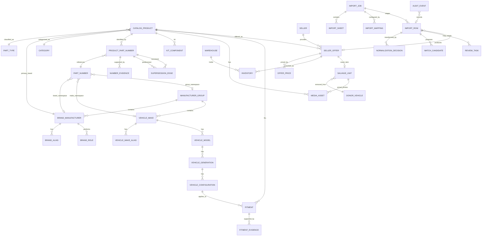
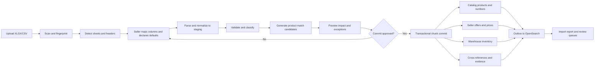

# Motor Parts Catalog Architecture and Buyer Experience

**Decision document — PartsBazar360**  
**Date:** 17 July 2026  
**Evidence:** DXB-EXW (Special_2), 6,795 rows; FEBEST Availability, 18,519 rows; current PartsBazar360 Prisma, ingestion, upload, search, and buyer contracts.

## 1. Executive recommendation

PartsBazar360 should use a **catalog-product / seller-offer / warehouse-inventory** model, with part numbers, fitment, brands, vehicle makes, salvage provenance, and decision evidence stored as separate relational records. The catalog product is the shared technical identity; the seller offer is the commercial proposition; inventory is the warehouse-specific stock position. A seller spreadsheet row is evidence used to create or match those records, not the catalog record itself.

The most important rules are:

1. Never combine part brand and vehicle make. A product can be branded FEBEST, cross-reference Ford and Mazda OEM numbers, fit Ford and Mazda vehicles, and be sold by several sellers.
2. Never classify a row as genuine OEM because its `Brand` looks like a vehicle make. Product-level classification must combine seller declaration, brand roles, number evidence, catalog matches, packaging/source evidence, and review.
3. Never use an OEM cross-reference as proof of vehicle fitment. Cross-reference evidence and fitment evidence have separate records, sources, confidence, and buyer copy.
4. Never create a new buyer-facing product page for every seller row. Match to a shared product first, then attach an offer; salvage units remain unique because condition and donor history differ.
5. Never discard or overwrite source data. Store the file, sheet, row, original cells, normalized values, mapping version, decisions, actors, timestamps, and confidence.
6. Never store compound OEM text only as a string. Preserve the raw cell, but create one structured cross-reference record per make/number token.
7. Treat uncertain data honestly. High-confidence decisions can commit automatically; medium-confidence rows commit in a non-live/review state; low-confidence rows require confirmation before catalog creation or offer activation.

The target architecture can be introduced incrementally on the current NestJS, PostgreSQL/Prisma, BullMQ/Redis, and OpenSearch stack. It does not require replacing the platform.

---

## 2. What the attached spreadsheets actually show

### 2.1 DXB-EXW profile

The workbook contains one table, `A1:G6796`, with 6,795 data rows and seven complete columns.

| Finding | Observed result | Architectural consequence |
|---|---:|---|
| Rows | 6,795 | Must use chunked asynchronous imports, not a request-bound row loop. |
| Distinct `BRAND` values | 52 | A controlled alias/master workflow is practical and necessary. |
| `CODE` values | One value: `1203` | `CODE` is source/catalog context, not a unique SKU. It cannot identify offers or products. |
| Largest labels | Mitsubishi 1,645; Toyota 959; Honda 761; Subaru 655; Nissan 571 | Make-looking labels dominate but do not prove genuine status. |
| Group/supplier labels | Mercedes Benz 478; VAG 404; General Motors 222; MOBIS 192 | A label may be a make alias, manufacturer group, parts organization, or supplier role. |
| Aftermarket labels | Gates 101; Denso 24; Bosch 19; Meyle 2; SKF 2; Ashika 1 | The file is mixed; seller-level defaults cannot safely classify every row. |
| Duplicate normalized `brand + part number` | 0 | The source itself is clean on this key, but this says nothing about duplicates already in the marketplace. |
| Missing cells | 0 across all seven fields | Completeness is good for commerce fields, poor for technical identity because titles, categories, images, and fitment are absent. |
| Quantity | min 1; median 10; max 16,103 | Preserve seller quantity; validate extreme values but do not cap silently. |
| MOQ | min 1; median 1; max 10 | MOQ belongs to the offer, not the product. |
| USD price | min $0.02; median $6.56; max $3,333.89 | Use decimal/minor-unit money types and configurable plausibility checks. |
| AED price | Exact conversion at 3.6725 AED/USD for all 6,795 rows | Store source prices and rate provenance; do not maintain two independent prices that can drift. |

Representative evidence:

| Source row | Source values | Correct interpretation |
|---:|---|---|
| 5 | `BMW`, `11147797490`, qty 35, MOQ 1, USD 32.77 | Candidate BMW-numbered product. Do **not** publish “Genuine BMW” until the number/brand role or seller evidence confirms genuine status. |
| 31 | `BOSCH`, `0250203012`, qty 6 | Bosch is a multi-role supplier/aftermarket brand. Treat the row as a Bosch-numbered candidate, not as a vehicle make and not automatically as OEM-equivalent. |
| 51 | `DENSO`, `1455300380`, qty 6 | Individual-product classification is required because Denso supplies OEM channels and sells aftermarket-branded parts. |
| 79 | `GATES`, `021603`, qty 20 | Strong aftermarket candidate, but it still lacks a description, category, cross-reference, and verified fitment. |
| 180 | `GENERAL MOTORS`, `02877481`, qty 16 | General Motors is a group/issuer context. The row needs make/brand resolution and number validation. |
| 3653 | `MOBIS`, `0510000181`, qty 49 | MOBIS can be an official parts supplier context; genuine status still needs product evidence. |
| 6392 | `VAG`, `000010006`, qty 40 | VAG is a manufacturer group/number namespace, not a buyer-selectable vehicle make. |

**DXB import conclusion:** every row can safely create a staged offer candidate, but most rows cannot safely create a complete live catalog product. Rows should first match by an issuer-aware part number; unmatched rows need catalog enrichment. Vehicle-make-looking values receive no automatic genuine badge without supporting evidence.

### 2.2 FEBEST Availability profile

The workbook contains one table, `A1:K18520`, with 18,519 data rows and 11 complete columns. All 18,519 normalized FEBEST references are unique in the file.

| Finding | Observed result | Architectural consequence |
|---|---:|---|
| Product rows | 18,519 | Each row is a FEBEST brand-part candidate and seller offer candidate. |
| OEM tokens | 93,542 | Compound cells must become individual cross-reference links. |
| OEM tokens per product | median 4; mean 5.05; observed range 1–10 | Cross-references are many-to-many and should be queryable independently. |
| Rows with more than one OEM number | 15,430 | A single `oem_number` column is structurally inadequate. |
| Rows with more than one vehicle make/group | 5,640 | Compatible/OEM-associated makes are many-to-many. |
| Major namespaces | Toyota 13,005; Nissan 10,581; Hyundai 7,566; Ford 6,980; Mazda 4,593; VAG 4,156; General Motors 4,125 | Issuer/group context is essential to matching and display. |
| Multi-word namespaces | General Motors 4,125; Alfa Romeo 2,437; Land Rover 1,222; Great Wall 456 | “First word = make” parsing would corrupt thousands of references. |
| Sharjah stock | median 5; max 734; 2,913 zero rows | One inventory row per offer/warehouse. |
| Jebel Ali stock | median 24; max 21,902; 3,819 zero rows | Warehouse-specific stock must remain independent. |
| Zero in both warehouses | 2,286 rows | Import but mark offer `OUT_OF_STOCK`/not purchasable; never convert zero to one. |
| Positive in at least one warehouse | 16,233 rows | Search availability should use sellable aggregate stock while PDP shows warehouse/ETA detail. |
| Price | min 0.15; median 22.97; max 735.16 | Currency is absent and must be a required import-template/default decision. |
| Weights | 12 zero/non-positive net; 9 zero/non-positive gross | Quarantine invalid logistics values without rejecting otherwise valid product identity. |
| Gross weight below net weight | 8 rows | Raise a logistics validation warning; examples include `GYAB-005` and `FDAB-086Z`. |
| Dimensions | populated, but units absent | Require unit selection/confirmation; likely units must never be silently assumed. |

The OEM prefix inventory also contains emerging/regional makes and groups such as Belgee, Lifan, BYD, Samsung, Hongqi, Li Auto/Lixiang, GAC, Jetour, Lynk & Co, and VAG. The controlled master must therefore be editable and versioned; a hardcoded Western-make list is not sufficient.

Representative evidence:

| Source row | FEBEST reference and source data | Structured interpretation |
|---:|---|---|
| 2 | `0282-F15R`, rear wheel hub; Sharjah 3; Jebel Ali 8; `NISSAN 43202-1KA0A, NISSAN 43202-BA60A`; price 135 | FEBEST brand number plus two Nissan OEM cross-reference links, two inventory records, one currency-confirmation requirement. Search key `432021KA0A` also matches `43202-1KA0A`. |
| 4 | `KSB-PICF`; both stocks 0; Hyundai and Kia both use `54812-07100` | One inactive/out-of-stock offer, two issuer-aware OEM links sharing the same normalized text. Do not collapse the issuer associations. |
| 6 | `MM-N43ARR`; Chrysler and Mitsubishi both use `MB581311` | Same visible number in two make namespaces; string equality alone is not sufficient for catalog merging. |
| 7 | `2101-CA2R`; nine Ford numbers plus `LAND ROVER LR 003655` | Longest controlled alias must match `LAND ROVER`, producing number `LR 003655`; first-word parsing would invent make `LAND`. |
| 10 | `MZAB-124`; Ford and Mazda references; stock 33/232 | One FEBEST product, six OEM cross-references, two associated makes, two inventories, and no verified model-level fitment yet. |

**FEBEST import conclusion:** seller default brand `FEBEST` and default type `AFTERMARKET` are high-value evidence, but row data still needs currency/unit declarations, structured OEM parsing, category normalization, and fitment enrichment. OEM references support lookup and matching; they do not justify a “Verified Fit” badge.

### 2.3 Data-quality conclusions across both files

1. A source may be commercially complete but technically incomplete (DXB).
2. A source may be technically rich but still omit operational metadata such as currency and units (FEBEST).
3. Source columns describe different layers. `Brand`, `Reference`, and `OEM` describe identity/evidence; price/MOQ describe an offer; stock columns describe inventory; dimensions describe logistics.
4. Column meaning depends on template context. FEBEST `Reference` is a brand MPN, while DXB `PART NUMBER` may be OEM, brand MPN, or unresolved.
5. The system must model uncertainty instead of forcing every row into a fully verified live product.

---

## 3. Catalog principles and controlled part types

### 3.1 Buyer-facing part types

| Code | Buyer label | Operational definition | Minimum evidence for live classification |
|---|---|---|---|
| `GENUINE_OEM` | Genuine OEM | New part manufactured, packaged, or officially supplied through the vehicle maker’s genuine channel. | Seller declaration plus verified OEM issuer/number or trusted catalog/packaging evidence. |
| `OEM_EQUIVALENT` | OEM supplier / OE-equivalent | Part from an OE supplier but not represented as genuine vehicle-maker packaging. | Verified manufacturer identity and product-channel evidence. Never inferred from supplier reputation alone. |
| `AFTERMARKET` | Aftermarket | Independent branded replacement part. | Verified brand MPN or trusted supplier catalog; seller declaration is supporting evidence. |
| `SALVAGE_OEM` | Used Original | Original part removed from a donor vehicle. | Donor/item evidence, used condition, and OEM identity where available. |
| `REMANUFACTURED` | Remanufactured | Used core restored through a defined remanufacturing process. | Remanufacturer/process and condition evidence. |
| `REFURBISHED` | Refurbished | Used part repaired/cleaned/tested without a full reman standard. | Seller/process evidence and condition disclosure. |
| `PERFORMANCE` | Performance / Upgrade | Intended to alter performance or specification from stock. | Manufacturer claim/specification; fitment still required unless universal. |
| `UNIVERSAL` | Universal Fit | Not tied to a specific vehicle configuration, but may require dimensional/connector checks. | Product design evidence and applicable constraints. |
| `OTHER` | Other / Unclassified | Temporary operational bucket; not a misleading buyer badge. | Requires review before prominent publication. |

Part type and condition are independent. `AFTERMARKET + NEW`, `GENUINE_OEM + NEW_OTHER`, `SALVAGE_OEM + USED_GRADE_A`, and `REMANUFACTURED + REMANUFACTURED` are all valid combinations.

### 3.2 Identity boundaries

| Concept | Belongs to | Examples |
|---|---|---|
| Part brand/manufacturer | Catalog product | FEBEST, Bosch, Denso, Gates |
| Genuine OEM issuer/make | Part-number association/product classification | BMW, Toyota, Ford; VAG/GM may be group namespaces |
| Compatible makes | Derived from verified fitments; optionally shown as cross-reference-only associations | Ford and Mazda for `MZAB-124` references |
| Donor vehicle | Salvage unit | 2021 Toyota Camry XSE, VIN…, 62,000 km |
| Seller | Offer | A trading business |
| Warehouse | Inventory | Sharjah, Jebel Ali |
| Price/MOQ/warranty | Offer | Seller-specific commercial terms |
| Quantity/bin | Inventory | Warehouse-specific fulfillment facts |

---

## 4. Target entity model



### 4.1 Important cardinality and uniqueness rules

- A catalog product has one primary brand identity and can have many part-number associations.
- A number’s identity is issuer-aware. Recommended uniqueness is `(normalized_number, namespace_type, namespace_id, number_type family)`, not `normalized_number` alone.
- A product can have multiple links to the same normalized number when issuer/source differs, as in Hyundai/Kia `54812-07100`.
- A seller has at most one active offer per `(seller, seller_sku, catalog_product)` unless the offers differ by condition/lot or commercial contract.
- Inventory is unique per `(offer_id, warehouse_id, bin/lot when applicable)`.
- Fitment is unique per product and precise vehicle configuration/position/region tuple, while multiple evidence records may support or dispute it.
- A salvage unit is normally one exact physical item or homogeneous dismantled lot. It is never merged with another item merely because OEM number and donor model match.

---

## 5. Field-level data dictionary

The following fields are the minimum production model. Use PostgreSQL `numeric` or integer minor units for money; avoid binary floating-point for price and exchange calculations.

### 5.1 Master data

| Entity.field | Type | Required | Meaning / rule |
|---|---|---:|---|
| `part_type.code` | enum/text PK | yes | Stable codes from §3.1; labels can be localized. |
| `part_type.display_name` | text | yes | Buyer-facing label. |
| `part_type.active` | boolean | yes | Prevent new use without deleting historical data. |
| `brand_manufacturer.id` | UUID | yes | Canonical parts brand/manufacturer identity. |
| `brand_manufacturer.canonical_name` | citext unique | yes | Normalized identity, e.g. `febest`. |
| `brand_manufacturer.display_name` | text | yes | `FEBEST`, `Mercedes-Benz`. |
| `brand_manufacturer.parent_group_id` | UUID FK | no | Corporate/manufacturer group. |
| `brand_manufacturer.logo_asset_id` | UUID FK | no | Approved logo, not arbitrary seller URL. |
| `brand_manufacturer.country_code` | char(2) | no | ISO country. |
| `brand_manufacturer.website_url` | text | no | Official URL with verification status. |
| `brand_manufacturer.manual_classification_required` | boolean | yes | True for multi-role/ambiguous entities. |
| `brand_manufacturer.status` | enum | yes | `ACTIVE`, `INACTIVE`, `MERGED`. |
| `brand_role.brand_id` | UUID FK | yes | Brand being described. |
| `brand_role.role` | enum | yes | `VEHICLE_MANUFACTURER`, `AFTERMARKET_BRAND`, `OEM_SUPPLIER`, `GENUINE_CHANNEL`, `REMANUFACTURER`, `DISTRIBUTOR`. Multiple allowed. |
| `brand_role.source/confidence/valid_from/valid_to` | provenance fields | yes | Roles are sourced and time-aware. |
| `brand_alias.alias_normalized` | citext | yes | Matchable alias such as `MERCEDES BENZ`. |
| `brand_alias.alias_type/region/language` | enum/text | no | Trade name, misspelling, abbreviation, regional label. |
| `vehicle_make.id` | UUID | yes | Buyer-selectable canonical vehicle make. |
| `vehicle_make.canonical_name/display_name` | text | yes | Separate from parts brand. |
| `vehicle_make.group_id` | UUID FK | no | Volkswagen Group, General Motors, etc. |
| `vehicle_make.region_codes` | text[] | no | Regional availability/naming. |
| `vehicle_make.external_ids` | JSONB or child table | no | TecDoc, ACES, eBay, internal, other IDs with source. |
| `vehicle_make_alias.alias_normalized` | citext | yes | `VW`, `Landrover`, regional name, etc. |
| `manufacturer_group.id/name/aliases` | UUID/text | yes | Group/namespace such as Volkswagen Group; groups are not silently presented as makes. |

### 5.2 Catalog product and technical identity

| Entity.field | Type | Required | Meaning / rule |
|---|---|---:|---|
| `catalog_product.id` | UUID | yes | Shared technical product identity. |
| `catalog_product.canonical_title` | text | yes for live | Generated from verified attributes; seller title is separate. |
| `catalog_product.normalized_part_name` | text | yes for live | E.g. `rear trailing arm bushing`. |
| `catalog_product.category_id` | UUID FK | yes for live | Leaf category in versioned taxonomy. |
| `catalog_product.part_type_code` | FK | yes | Product classification plus decision link. |
| `catalog_product.primary_brand_id` | UUID FK | conditional | Required for branded OEM/aftermarket/reman products. |
| `catalog_product.manufacturer_part_number_link_id` | UUID FK | conditional | Primary brand number association. |
| `catalog_product.genuine_oem_number_link_id` | UUID FK | no | Primary genuine number only when verified; other numbers remain linked. |
| `catalog_product.description` | text | no | Normalized editorial description. |
| `catalog_product.specifications` | JSONB/typed attributes | no | Category-schema-validated values and units. |
| `catalog_product.weight_kg` | numeric | no | Normalized net product weight; raw/source value preserved separately. |
| `catalog_product.package_weight_kg` | numeric | no | Gross shipping weight. |
| `catalog_product.length_mm/width_mm/height_mm` | numeric | no | Canonical dimensions after explicit unit conversion. |
| `catalog_product.position_front_rear` | enum | no | `FRONT`, `REAR`, `BOTH`, `NA`, `UNKNOWN`. |
| `catalog_product.position_left_right` | enum | no | `LEFT`, `RIGHT`, `PAIR`, `NA`, `UNKNOWN`. |
| `catalog_product.vehicle_system` | enum/FK | no | Braking, suspension, engine, electrical, etc. |
| `catalog_product.verification_status` | enum | yes | `STAGED`, `UNVERIFIED`, `REVIEWED`, `VERIFIED`, `REJECTED`, `MERGED`. |
| `catalog_product.completeness_score` | numeric(5,2) | yes | Presence/quality measure, not truth confidence. |
| `catalog_product.quality_score` | numeric(5,2) | yes | Source consistency and validation measure. |
| `catalog_product.created_from_import_row_id` | UUID FK | no | First provenance anchor. |
| `catalog_product.version/created_at/updated_at` | version/time | yes | Optimistic concurrency and history. |
| `product_media.asset_id` | UUID FK | yes | Product image/document link. |
| `product_media.media_role` | enum | yes | `PRIMARY`, `PRODUCT`, `DIAGRAM`, `PACKAGING`, `LABEL`, `ACTUAL_ITEM`. |
| `product_media.is_actual_item` | boolean | yes | Mandatory distinction for salvage. |
| `kit_component.kit_product_id/component_product_id` | UUID FK | yes | Explicit kit composition. |
| `kit_component.quantity/notes` | numeric/text | yes/no | Prevents a kit from being merged with a single component. |

### 5.3 Part numbers, cross-references, and supersession

| Entity.field | Type | Required | Meaning / rule |
|---|---|---:|---|
| `part_number.id` | UUID | yes | Reusable issuer-aware number identity. |
| `part_number.display_number` | text | yes | Original preferred formatting, e.g. `43202-1KA0A`. |
| `part_number.normalized_number` | text indexed | yes | Uppercase Unicode-normalized alphanumeric key, e.g. `432021KA0A`. |
| `part_number.number_type` | enum | yes | `BRAND_MPN`, `OEM`, `SUPERSEDED`, `REPLACED_BY`, `INTERCHANGE`, `SELLER_SKU`. |
| `part_number.namespace_type` | enum | yes | `BRAND`, `VEHICLE_MAKE`, `MANUFACTURER_GROUP`, `SELLER`, `UNKNOWN`. |
| `part_number.namespace_id` | UUID | conditional | Issuer/brand/make/group/seller ID. |
| `product_part_number.product_id/part_number_id` | UUID FK | yes | Many-to-many product link. |
| `product_part_number.relationship` | enum | yes | `PRIMARY`, `CROSS_REFERENCE`, `INTERCHANGE`, `HISTORICAL`, `SELLER_DECLARED`. |
| `product_part_number.verification_status` | enum | yes | `UNVERIFIED`, `SELLER_DECLARED`, `CORROBORATED`, `VERIFIED`, `DISPUTED`. |
| `product_part_number.confidence` | numeric(4,3) | yes | Evidence score, not fitment score. |
| `number_evidence.source_type/source_id/source_url` | provenance | yes | Spreadsheet row, manufacturer catalog, TecDoc, manual review, etc. |
| `number_evidence.original_value/observed_at` | text/time | yes | Audit and reprocessing. |
| `supersession_edge.from_number_link_id` | UUID FK | yes | Older/superseded product-number link. |
| `supersession_edge.to_number_link_id` | UUID FK | yes | Replacement/successor link. |
| `supersession_edge.relation/direction/status` | enum | yes | Directed edge; never flatten a chain into unordered strings. |
| `supersession_edge.effective_date/source/confidence` | provenance | no/yes | Supports temporal catalogs and rollback. |

### 5.4 Vehicle and fitment

| Entity.field | Type | Required | Meaning / rule |
|---|---|---:|---|
| `vehicle_model.make_id/name/aliases` | FK/text | yes | Canonical model under a make. |
| `vehicle_generation.model_id/name/year_from/year_to` | typed | yes/no | Generation/chassis period; dates may be month-granular. |
| `vehicle_configuration.id` | UUID | yes | Precise fitment target. |
| `vehicle_configuration.trim` | text | no | Trim/series. |
| `vehicle_configuration.engine/engine_code` | text | no | Keep display and canonical code. |
| `vehicle_configuration.transmission/body_style/drive_type/fuel` | enums/FKs | no | Typed discriminators. |
| `vehicle_configuration.region/chassis` | text/FK | no | Regional model and chassis constraints. |
| `vehicle_configuration.production_from/to` | date | no | Prefer production dates over year-only when available. |
| `fitment.product_id/vehicle_configuration_id` | UUID FK | yes | Claimed product-to-vehicle relation. |
| `fitment.position_front_rear/left_right` | enum | no | Fitment-specific position can be narrower than product default. |
| `fitment.status` | enum | yes | `VERIFIED_FIT`, `PROBABLE_FIT`, `SELLER_DECLARED`, `UNVERIFIED`, `EXPLICIT_NOT_FIT`. |
| `fitment.confidence` | numeric(4,3) | yes | Computed from active evidence. |
| `fitment.additional_notes` | text | no | Constraints, production splits, connector notes. |
| `fitment_evidence.evidence_type` | enum | yes | `MANUFACTURER_CATALOG`, `TECDOC`, `ACES`, `OEM_CATALOG`, `SELLER_DECLARATION`, `TITLE_PARSE`, `MANUAL_CONFIRMATION`, `NEGATIVE`. |
| `fitment_evidence.source_id/source_url/source_version` | provenance | yes/no | Traceable and refreshable. |
| `fitment_evidence.scope/confidence/status` | typed | yes | Evidence may cover exact config, generation, engine, or make/model only. |
| `fitment_evidence.reviewed_by/reviewed_at` | actor/time | no | Human approval. |

### 5.5 Seller offer, price, and inventory

| Entity.field | Type | Required | Meaning / rule |
|---|---|---:|---|
| `seller_offer.id/seller_id/catalog_product_id` | UUID FK | yes | Commercial offer attached to shared product. |
| `seller_offer.seller_sku` | text | yes | Seller namespace; unique per seller where seller guarantees it. |
| `seller_offer.seller_title` | text | no | Preserved seller wording; never overwrites canonical title. |
| `seller_offer.declared_part_type` | enum | yes | Seller answer to “What are you selling?” |
| `seller_offer.condition/condition_grade` | enum | yes/no | Standard condition plus optional grade. |
| `seller_offer.moq` | integer | yes | Minimum purchasable units; must be ≥1. |
| `seller_offer.lead_time_min/max` | interval/integer | no | Delivery/dispatch range. |
| `seller_offer.delivery_method` | enum[] | no | Pickup, courier, freight, etc. |
| `seller_offer.warranty_terms/return_policy` | text/FK | no | Offer-specific snapshots. |
| `seller_offer.import_row_id` | UUID FK | yes | Source audit link. |
| `seller_offer.listing_status` | enum | yes | `DRAFT`, `REVIEW`, `ACTIVE`, `OUT_OF_STOCK`, `SUSPENDED`, `ARCHIVED`. |
| `offer_price.amount_minor/currency` | bigint/char(3) | yes | Source/customer price with ISO currency. |
| `offer_price.price_type` | enum | yes | `SELLER_BASE`, `MARKETPLACE`, `SALE`, `WHOLESALE`. |
| `offer_price.valid_from/to` | timestamp | yes/no | Price history and scheduled changes. |
| `offer_price.exchange_rate/rate_source/rate_time` | numeric/text/time | no | Required when deriving AED from USD. |
| `inventory.offer_id/warehouse_id` | UUID FK | yes | Warehouse-specific stock. |
| `inventory.on_hand/reserved/available` | integer | yes | `available = max(on_hand - reserved, 0)`; reservation updates transactionally. |
| `inventory.bin_location/lot_number` | text | no | Operations detail. |
| `inventory.stock_status` | enum | yes | `IN_STOCK`, `LOW_STOCK`, `OUT_OF_STOCK`, `BACKORDER`, `UNKNOWN`. |
| `inventory.source_updated_at/import_row_id` | time/FK | yes | Staleness and audit. |

### 5.6 Salvage extension

| Entity.field | Type | Required | Meaning / rule |
|---|---|---:|---|
| `donor_vehicle.make/model/generation/year` | FK/text/int | yes | Donor identity, separate from compatibility. |
| `donor_vehicle.trim/engine/engine_code/transmission` | text | no | Donor configuration. |
| `donor_vehicle.vin_encrypted/vin_hash/vin_masked` | secure fields | no | Encrypt full VIN, hash for matching, expose only masked value. |
| `donor_vehicle.mileage/mileage_unit` | integer/enum | no | Explicit km/mi. |
| `donor_vehicle.donor_stock_number` | text | yes | Dismantler namespace. |
| `salvage_unit.offer_id/donor_vehicle_id` | UUID FK | yes | Exact item for sale. |
| `salvage_unit.original_oem_number_link_id` | UUID FK | no | May be absent/unreadable. |
| `salvage_unit.condition_grade/tested_status` | enums | yes | Grade and test result are distinct. |
| `salvage_unit.damage_notes/missing_components` | text/text[] | no | Material disclosure. |
| `salvage_unit.warranty_terms` | text/FK | no | Item-specific snapshot. |
| `salvage_unit.dismantling_location/shelf_bin` | text | no | Fulfillment trace. |
| `salvage_unit.identity_method` | enum | yes | `OEM_NUMBER`, `DONOR_POSITION`, `VISUAL`, `INTERCHANGE`, `MANUAL`; supports unreadable numbers. |

### 5.7 Import, decision, and audit records

| Entity.field | Type | Required | Meaning / rule |
|---|---|---:|---|
| `import_job.id/seller_id/template_id` | UUID FK | yes | Import session and reusable template. |
| `import_job.file_name/file_hash/object_key` | text | yes | SHA-256 enables idempotency and file audit. |
| `import_job.status/counters` | enum/JSONB | yes | Uploaded → mapped → previewed → committing → completed/failed. |
| `import_job.defaults` | JSONB | yes | Declared type, brand, currency, units, warehouses, locale. |
| `import_sheet.sheet_name/header_row/data_range` | typed | yes | Sheet detection result. |
| `import_mapping.source_column/target_field/transform/version` | typed | yes | Seller-approved mapping. |
| `import_row.row_number/raw_json/raw_hash` | typed | yes | Immutable original row. |
| `import_row.normalized_json/validation_status` | JSONB/enum | yes | Derived representation; can be regenerated. |
| `normalization_decision.field/original/normalized/rule_id` | typed | yes | Every non-trivial change. |
| `normalization_decision.confidence/reason/actor/time` | provenance | yes | Required governance fields. |
| `match_candidate.product_id/score/rank` | typed | yes | Candidate list, not just winning ID. |
| `match_candidate.features/explanation/status` | JSONB/text/enum | yes | Auditable scoring and acceptance. |
| `review_task.type/severity/assignee/status` | typed | yes | Brand, classification, match, fitment, logistics, or content review. |
| `audit_event.entity_type/entity_id/action` | typed | yes | Immutable change event. |
| `audit_event.before/after/source/actor/time` | JSONB/provenance | yes | Complete change history. |

---

## 6. Flexible spreadsheet-import architecture

### 6.1 State machine



### 6.2 Upload and detection

1. Accept `.xlsx`, `.xls` through a conversion service if required, `.csv`, and `.tsv`; enforce size, row, sheet, formula, and archive-expansion limits.
2. Store the immutable original in object storage, calculate SHA-256, scan for malware, and reject password-protected or malformed files with a recoverable message.
3. Detect non-empty sheets, merged/header regions, candidate header rows, tables, hidden sheets, formulas, and used ranges. Do not evaluate external links or macros.
4. Sample at least 100 distributed rows per sheet for type and mapping inference, not only the first rows.
5. Detect likely currency and units from headers/cells, but require confirmation when absent or ambiguous.
6. Match the header signature against versioned seller templates. A template proposes mappings and defaults; it never changes the meaning of the original file.

### 6.3 Mapping experience

The seller sees a side-by-side preview: source column, sample values, proposed target, transform, confidence, required action, and validation examples. Available targets include product identity, seller offer, warehouse inventory, cross-reference, fitment, donor vehicle, ignore, and custom attribute.

Required import declarations:

- “What are you selling?”: Genuine OEM / Aftermarket replacement / Salvage-used original / Remanufactured / Refurbished / Mixed / Unsure.
- Default part brand when the file omits it.
- Price currency and whether price includes tax/marketplace charges.
- Weight and dimension units.
- Default condition.
- Warehouse mapping for every stock column.
- Whether zero means out of stock, unknown, or unavailable in that warehouse; default is numeric zero = out of stock.

Mixed files expose a row-level `part type` mapping/override. The preview must show how many rows use the default and how many override it.

### 6.4 Staging before commit

Parsing writes to staging only. It must not create live products or offers while reading rows. Recommended layers:

1. **Raw:** original file, sheet, row, and cell values.
2. **Mapped:** source columns assigned to platform fields.
3. **Normalized:** canonical brand/make IDs, number keys, money, quantities, and SI units.
4. **Enriched:** category candidates, parsed OEM links, classification evidence, match candidates, and fitment evidence.
5. **Decision:** import, match, create draft, review, reject, or skip.
6. **Committed:** stable IDs of all created/updated records.

Commit in idempotent batches, for example 250–1,000 rows. A row with the same `(import_job_id, sheet_id, row_number, raw_hash, mapping_version)` must not create records twice. Use database transactions per batch and an outbox for search indexing so OpenSearch failure does not roll back source-of-truth data.

### 6.5 Column mappings for the supplied files

#### DXB-EXW

| Source column | Platform destination | Transform / note |
|---|---|---|
| `CODE` | `import_row.source_context.catalog_code` | Preserve `1203`; do not use as product or offer key because every row shares it. |
| `BRAND` | `import_row.brand_original` → brand/group resolution candidate | Resolve through brand, vehicle-make, and group alias masters. Do not directly populate product make or type. |
| `PART NUMBER` | staged part number | Preserve display; create normalized key; number type/namespace follows classification/match evidence. |
| `QTY` | inventory `on_hand` | Map to explicitly selected warehouse; no warehouse is present in the file. |
| `MOQ` | `seller_offer.moq` | Integer ≥1. |
| `PRICE USD` | source `offer_price` USD | Use as source price unless seller chooses otherwise. |
| `PRICE AED` | derived/quoted AED price evidence | The file uses exactly 3.6725 AED/USD. Persist the rate and source time; pick one authoritative commercial price rather than dual editable values. |
| Missing title/category/images/fitment | review/enrichment tasks | Do not invent. Match an existing catalog product or keep the offer draft. |

#### FEBEST Availability

| Source column | Platform destination | Transform / note |
|---|---|---|
| Template default | `primary_brand = FEBEST`, `part_type = AFTERMARKET` | Store seller declaration and template version as classification evidence. |
| `Reference` | primary `BRAND_MPN` | Display as supplied; normalize punctuation for search. |
| `Description` | seller title + product-name candidate | Normalize case/position/kit terms; category mapping remains reviewable. |
| `Stock (Sharjah)` | inventory for Sharjah warehouse | Separate row; preserve zero. |
| `Stock (Jebel Ali)` | inventory for Jebel Ali warehouse | Separate row; preserve zero. |
| `OEM` | many `OEM` cross-reference candidates | Parse into individual issuer-aware links; retain the complete cell. |
| `Price` | `offer_price.amount` | Currency is absent; block commit until template/default currency is confirmed. |
| `Net Weight` / `Gross weight` | product/logistics weight candidates | Unit is absent; require confirmation and validate gross ≥ net. |
| `Length` / `Width` / `Height` | package/product dimensions | Unit is absent; require confirmation and store raw values plus normalized millimetres. |

### 6.6 Import result report

Report both row counts and entity effects. One row can create six cross-references and two inventory records, so “imported rows” alone is misleading.

- Rows received, parsed, skipped, invalid, committed, and requiring review.
- Products exactly matched, probabilistically matched/approved, newly drafted, and newly verified.
- Offers created, updated, unchanged, suspended, and out of stock.
- Inventory rows created/updated by warehouse.
- Part-number and OEM cross-reference links created, matched, disputed, or unrecognized.
- Duplicate source rows, within-file normalized collisions, and existing-catalog collisions.
- Unrecognized/ambiguous brands, makes, groups, categories, currencies, and units.
- Classification confidence distribution and review reasons.
- Missing description, images, fitment, identifiers, price, or logistics data.
- Downloadable row-level error file containing source row, field, original value, normalized value, code, message, and proposed resolution.

---

## 7. Compound OEM-reference parsing

### 7.1 Parsing algorithm

For each OEM cell:

1. Retain the untouched raw string and source coordinates.
2. Normalize Unicode punctuation and whitespace only for parsing; never overwrite display text.
3. Split on configured delimiters outside quotes/parentheses. The FEBEST file uses commas, but templates may use semicolons, pipes, or line breaks.
4. For each token, run **longest-match-first** against active vehicle-make aliases and manufacturer-group aliases. `GENERAL MOTORS` must win before `GENERAL`; `LAND ROVER` before `LAND`; `MERCEDES-BENZ` and `MERCEDES BENZ` map to one canonical identity.
5. Require an alias boundary. Do not match `FORD` inside another word.
6. Treat VAG/Volkswagen Group and General Motors as group namespaces where the data does not identify a specific make. Do not fabricate Volkswagen or Chevrolet fitment.
7. The remaining text is the display part number. Trim surrounding punctuation, but preserve internal spaces and hyphens.
8. Produce the normalized search key using Unicode NFKC, uppercase, and removal of separators/punctuation while retaining only letters and digits.
9. Validate token length and character shape, but do not reject legitimate short/numeric numbers solely by a generic regex.
10. If no controlled alias matches, create an `UNRECOGNIZED_NAMESPACE` review item with the raw token. Never fall back to the first word.
11. De-duplicate exact `(product, namespace, normalized number, source)` repeats; preserve distinct namespaces and sources.

Example:

```text
Raw cell:
FORD BT4Z-5500-B, FORD BT4Z-5500-C,
MAZDA TD11-28-200C, MAZDA TD13-28-250C

Records:
{ namespace: Make/Ford,  display: "BT4Z-5500-B", normalized: "BT4Z5500B" }
{ namespace: Make/Ford,  display: "BT4Z-5500-C", normalized: "BT4Z5500C" }
{ namespace: Make/Mazda, display: "TD11-28-200C", normalized: "TD1128200C" }
{ namespace: Make/Mazda, display: "TD13-28-250C", normalized: "TD1328250C" }
```

### 7.2 Namespace ambiguity

Some strings are number prefixes rather than make words. In `LAND ROVER LR 003655`, the controlled alias consumes `LAND ROVER`; `LR 003655` remains the number. In `MITSUBISHI MB581311`, `MB` belongs to the number. This is why heuristic “all words before the first digit” parsing is also unsafe.

Unknown aliases enter a governance queue. The FEBEST data includes VAG and newer/regional names, demonstrating that the alias dictionary must be versioned and deployable through admin data, not application code.

### 7.3 Part-number search normalization

Keep at least three forms:

- `display_number`: seller/manufacturer formatting.
- `normalized_exact`: uppercase alphanumeric (`432021KA0A`).
- `search_tokens`: optional manufacturer-aware segmentation/prefix forms.

Exact normalized matches should outrank fuzzy matches. Do not use edit-distance fuzzy matching for short identifiers; a one-character difference may identify a different left/right or revision part. Fuzzy candidates must require corroboration and review.

---

## 8. Brand, make, and group normalization

Resolution order:

1. Exact canonical name.
2. Exact active alias for seller/region/template.
3. Normalized alias (case, punctuation, whitespace).
4. External identifier match.
5. High-precision suggested match with reviewer confirmation.
6. Unrecognized master-data task.

An alias maps to a typed target: brand/manufacturer, vehicle make, or manufacturer group. `VAG` maps to Volkswagen Group, not automatically to Volkswagen make. `MOBIS` maps to a parts brand/supplier. `Mercedes Benz` may resolve to the Mercedes-Benz vehicle make and/or parts-brand context depending on the mapped source field; the typed column context and product evidence determine which relation is used.

Brand roles are many-to-many and sourced. For Denso:

```text
Brand: Denso
Roles: OEM_SUPPLIER, AFTERMARKET_BRAND
Product A evidence: Denso branded MPN + aftermarket catalog → AFTERMARKET
Product B evidence: vehicle-maker genuine package + verified OEM number → GENUINE_OEM
```

The brand master must never encode “all Denso parts are aftermarket” or “all Denso parts are genuine.”

---

## 9. Product classification and confidence

### 9.1 Evidence model

Classification is a versioned decision with positive and negative features. Suggested scoring bands:

- **High ≥ 0.90:** auto-classify and activate only if all other publication requirements pass.
- **Medium 0.65–0.899:** create/update draft offer and product; visible review warning; no unsupported genuine badge.
- **Low < 0.65:** require seller/admin confirmation before product creation or activation.

Scores are calibrated from reviewed outcomes; they are not arbitrary permanent constants. Store the scoring model/rule version.

| Evidence | Typical effect | Notes |
|---|---:|---|
| Seller explicit part-type declaration | strong positive | Important but not conclusive. Conflicts create review. |
| Trusted supplier template default | medium/strong | FEBEST aftermarket template is strong contextual evidence. |
| Exact match to verified catalog product and namespace-aware MPN | very strong | Prefer existing verified classification. |
| Exact verified OEM catalog number and genuine-channel evidence | very strong for genuine | Number alone without channel/product evidence may be insufficient. |
| Brand has aftermarket role | supporting | Never decisive when the brand has multiple roles. |
| Brand matches vehicle make | weak supporting only | Never enough for genuine. |
| Manufacturer part-number pattern | supporting | Patterns can collide or change. |
| OEM cross-reference list on aftermarket product | positive for aftermarket cross-reference, not genuine | FEBEST is the prime example. |
| Used condition + donor evidence | strong for salvage | Donor must not become the only fitment. |
| Conflicting seller declaration and verified catalog | strong negative | Quarantine and review. |
| Missing brand/number/source evidence | negative | May remain unclassified draft. |

### 9.2 Example decisions

- **FEBEST `MZAB-124`:** seller/template says aftermarket; verified FEBEST reference; OEM field lists Ford/Mazda replacements. Classify `AFTERMARKET` at high confidence. Cross-references remain seller/supplier-declared until corroborated. Fitment remains unverified.
- **DXB BMW `11147797490`:** make-looking brand and plausible number yield a medium genuine candidate, not a final classification. An exact verified BMW catalog match or genuine-channel evidence can raise it to high confidence.
- **DXB Gates `021603`:** Gates brand role and brand-number match can support high-confidence aftermarket classification if the brand reference is verified; technical content still needs match/enrichment before a complete live page.
- **Seller claims genuine OEM, but number belongs to a known aftermarket MPN:** low/conflicting confidence; offer remains review, buyer never sees Genuine OEM.

### 9.3 Classification is product-level; declarations are offer-level evidence

The seller offer retains what the seller declared. The catalog product holds the current adjudicated type. If they disagree, the offer is blocked or relabeled only after review; the original claim remains in the audit trail.

---

## 10. Product matching and duplicate detection

Matching is candidate generation followed by a decision. Do not use one universal SQL `upsert` key.

### 10.1 Candidate stages

1. **Exact trusted identity:** same primary brand namespace + exact normalized MPN.
2. **Exact genuine identity:** same OEM issuer namespace + exact normalized OEM number, with compatible product category/position.
3. **Verified cross-reference intersection:** trusted cross-reference set overlaps and category/position/specs agree.
4. **Content similarity:** normalized part name/category, dimensions/weight, position, kit status, images, and verified fitment overlap.
5. **Seller-history/template match:** previously approved mapping for this seller SKU or row signature.

### 10.2 Hard blockers to automatic merge

- Same number but different brand/issuer namespace.
- Conflicting left/right, front/rear, kit/single, size, connector, engine, or generation.
- Genuine versus aftermarket products with different physical brand identity.
- Salvage exact item versus catalog product/another salvage item.
- Supersession without evidence that the new number is interchangeable.
- Material specification or category conflict.

### 10.3 Suggested matching bands

| Score / rule | Action |
|---|---|
| Exact trusted brand MPN and no blockers | Auto-match; record rule/evidence. |
| ≥0.92 probabilistic score and no blockers | Auto-match for approved templates; sample-audit. |
| 0.75–0.919 | Reviewer compares candidates and differences. |
| <0.75 | Create a staged product candidate, not a live duplicate. |

Every reviewer merge must pick a surviving canonical product, redirect old product IDs, migrate offers/numbers/fitment/evidence transactionally, retain merge history, and trigger search reindexing. An unmerge/rollback process is required for erroneous merges.

### 10.4 Same OEM number under multiple names

`KSB-PICF` and `MM-N43ARR` show that identical normalized numbers can appear under multiple issuer labels. Store both associations. String equality may contribute to a candidate score, but cannot determine that two catalog products or two issuers are identical.

### 10.5 Supersession

Represent `SUPERSEDES`/`REPLACED_BY` as directed edges between issuer-aware number links. A successor may be backward-compatible, forward-compatible, region-specific, or require additional components; those properties belong to evidence/notes. Search may resolve an old number to current products, but the PDP must say why.

---

## 11. Fitment architecture and confidence

### 11.1 Evidence levels

Recommended buyer-facing status derives from evidence, not a single import flag:

| Internal evidence/status | Buyer result | Minimum scope |
|---|---|---|
| Verified manufacturer/OEM catalog or two corroborating trusted sources; ≥0.90 | **Confirmed to fit your vehicle** | Exact configuration or a generation range that explicitly covers its engine/trim/region constraints. |
| Strong but incomplete evidence; 0.70–0.899 | **Additional vehicle details required** or **Likely fit—confirm details** | Some configuration discriminators missing. |
| Seller-declared/title parsed; 0.40–0.699 | **Fitment has not yet been verified** | Advisory only; never green “Verified Fit.” |
| OEM cross-reference only | **Check fitment** | Number lookup evidence, not a vehicle relation. |
| Explicit negative evidence | **Does not fit your vehicle** | Exact conflicting configuration/position/region. |
| Universal product with constraint evidence | **Universal Fit—check dimensions/connectors** | No false exact-fit promise. |

The existing A/B/C… evidence scheme can be migrated, but evidence source/scope must become first-class records rather than being compressed into one letter.

### 11.2 Fitment check response

`POST /fitment/check` should accept `productId` plus `vehicleConfigurationId` (or VIN-resolved configuration) and return:

```json
{
  "status": "ADDITIONAL_DETAILS_REQUIRED",
  "confidence": 0.82,
  "matchedOn": ["make", "model", "generation", "year"],
  "missing": ["engineCode"],
  "conflicts": [],
  "position": "REAR_LEFT_OR_RIGHT",
  "evidenceSummary": [
    { "type": "SUPPLIER_CATALOG", "scope": "GENERATION", "verifiedAt": "2026-07-17" }
  ],
  "disclaimer": "OEM cross-references alone do not confirm every vehicle configuration."
}
```

### 11.3 Donor versus fitment

For salvage, donor data proves origin and helps identify the item. It is not the only compatibility relation. A used Toyota part can have verified fitments to several Toyota/Lexus configurations, while the PDP separately states the exact donor vehicle.

---

## 12. Review workflows and data governance

### 12.1 Seller preview/review

Before commit, the seller sees:

- Detected mappings/defaults and their confidence.
- A representative row preview, including parsed OEM tokens and warehouse inventory.
- Counts by classification and proposed match action.
- Blocking errors versus warnings.
- Changed values with original/normalized forms.
- Rows that will update existing offers versus create products/offers.

Seller actions: correct mapping, set/override part type, choose currency/units/warehouse, accept match, reject match, edit row, exclude row, or submit to admin review. Sellers cannot self-approve genuine status where evidence conflicts with verified catalog data.

### 12.2 Admin queues

| Queue | Reviewer sees | Available actions |
|---|---|---|
| Brand/make/group resolution | Raw value, alias candidates, row frequency, seller/template context | Map alias, create master, mark group, reject value. |
| Classification | Seller claim, brand roles, number matches, packaging/catalog evidence, conflicts | Confirm type, request evidence, suspend claim. |
| OEM cross-reference | Parsed make/group and number, supporting sources, products using it | Verify, dispute, correct namespace/format, split/merge evidence. |
| Product match/merge | Side-by-side technical fields, numbers, fitment, offers, blockers | Match, create new, merge, reject, escalate. |
| Fitment | Exact configuration, evidence scope/source, conflicts | Verify, narrow scope, mark probable/not-fit, expire evidence. |
| Category/title/content | Candidate taxonomy, description, images, positions/specs | Approve normalized content, request data. |
| Logistics | Units, zero weights, gross<net, extreme dimensions/stock | Correct unit/value, mark unknown, reject logistics only. |

### 12.3 Scoring and audit

- **Completeness** measures whether expected fields exist.
- **Quality** measures validity and consistency.
- **Classification confidence** measures part-type truth.
- **Match confidence** measures product identity.
- **Fitment confidence** measures vehicle applicability.

Never combine these into one opaque score. Every automated classification, match, merge, alias, normalization, and fitment decision stores source, timestamp, confidence, reason/features, original value, normalized value, responsible system/user, and rule/model version.

---

## 13. Buyer search and vehicle journey

### 13.1 Entry paths

The buyer can begin with:

1. **My Vehicle:** year → make → model → generation → trim/engine/configuration, or VIN lookup.
2. **Part number:** OEM, brand MPN, superseded, replacement, interchange, or seller SKU.
3. **Keyword/category:** product name, system, category, brand, position.
4. **Salvage context:** donor make/model/year or dismantler stock number, clearly labeled as donor search.

The active vehicle persists in the account/device garage and remains visible in the header, search results, PDP, cart, and checkout. Vehicle selection narrows or ranks results according to explicit buyer mode:

- `Show confirmed fits only` — strict verified configuration IDs.
- `Show possible matches` — adds probable/cross-reference candidates with warnings.
- `Browse all` — no vehicle filter; fitment state still displayed.

Do not silently hide items only because fitment is missing. A buyer searching an exact OEM number may intentionally need a part with incomplete structured fitment.

### 13.2 Query routing and ranking

Detect part-number-like queries and run normalized exact matching first. Recommended rank order:

1. Exact primary brand MPN in the correct namespace.
2. Exact verified OEM number in the issuer namespace.
3. Exact verified superseded/interchange number.
4. Confirmed fit for My Vehicle.
5. Category/name relevance and position/spec alignment.
6. Offer availability, delivery, seller quality, warranty, and data completeness.
7. Probable/cross-reference-only matches, visibly separated.

Search facets should distinguish:

- Part type.
- Part brand/manufacturer.
- Genuine/OEM make or number issuer.
- Compatible vehicle make/model only when supported by fitment.
- Condition and salvage grade.
- Category/system/position.
- Seller, warehouse/dispatch region, price, availability, delivery, and warranty.

One generic `brand` facet is insufficient.

### 13.3 OpenSearch document shape

Index at the catalog-product level, with nested/structured summaries:

```json
{
  "productId": "...",
  "title": "FEBEST Rear Trailing Arm Bushing — MZAB-124 — Fits Ford/Mazda",
  "partType": "AFTERMARKET",
  "primaryBrand": { "id": "febest", "name": "FEBEST" },
  "partNumbers": [
    { "type": "BRAND_MPN", "display": "MZAB-124", "normalized": "MZAB124", "brandId": "febest", "verified": true },
    { "type": "OEM", "display": "BT4Z-5500-B", "normalized": "BT4Z5500B", "makeId": "ford", "verified": false }
  ],
  "verifiedVehicleConfigIds": [],
  "probableVehicleConfigIds": [],
  "crossReferenceMakeIds": ["ford", "mazda"],
  "offers": {
    "activeCount": 1,
    "minPrice": { "amountMinor": 2347, "currency": "CONFIRM_SOURCE" },
    "availableQuantity": 265,
    "warehouseIds": ["sharjah", "jebel-ali"]
  }
}
```

Use exact keyword subfields for normalized numbers, text analyzers for names/descriptions, and nested queries for issuer-number pairs. Do not index all cross-reference makes into the same field as verified compatible makes.

---

## 14. Search-result card design

Use one product card per shared catalog product, with the best/relevant offer summarized and an offer count when multiple sellers exist.

### 14.1 Information hierarchy

1. Product image or honest placeholder.
2. Part-type badge: Genuine OEM / Aftermarket / Used Original / Remanufactured / Universal.
3. Clean title generated from verified identity.
4. Contextual identity:
   - Genuine: `Genuine make: BMW` and `OEM part number: 11147797490`.
   - Aftermarket: `Brand: FEBEST`, `Brand part number: MZAB-124`, `Replaces OEM numbers for: Ford, Mazda`.
   - Salvage: `Original make: Toyota`, `Donor: 2021 Toyota Camry`, exact condition grade.
5. Vehicle state: `Confirmed for your …`, `Additional details required`, `Check fitment`, `Does not fit`, or `Universal—check specs`.
6. Condition and whether the image is the actual item.
7. Price, stock state, delivery estimate, seller, warranty, and dispatch region.
8. `3 offers from AED …` where appropriate.

Never show `Fits Ford/Mazda` solely because the OEM cell names those makes. Use `Replaces OEM numbers for Ford/Mazda` until fitment is verified.

### 14.2 Example cards

**Aftermarket**

```text
[Aftermarket] FEBEST Rear Trailing Arm Bushing
Brand part number: MZAB-124
Replaces OEM numbers for: Ford (2), Mazda (4)
Fitment: Check fitment — select trim and engine
From [confirmed currency] 23.47 • 265 across 2 warehouses
Seller • dispatch estimate • warranty
```

**DXB unresolved/genuine candidate**

```text
[Part type under review] Oil Filter Housing — 11147797490
Number associated with: BMW
Fitment not verified • Product identity incomplete
Seller offer available after catalog verification
```

Do not generate “Genuine BMW” from the spreadsheet alone.

---

## 15. Product-detail page

### 15.1 Product identity header

- Canonical product name and image gallery.
- Part-type badge and verification state.
- Contextual brand/genuine make labels.
- Primary brand MPN and primary OEM number where verified.
- Category, system, position, condition, and actual-item indicator.
- Clear notice if data is seller-declared or under review.

### 15.2 Fitment checker

Prominent control: **Select your vehicle to confirm fitment**. The verdict explains matched attributes, missing details, conflicts, evidence type/date, and next action. Avoid exposing raw confidence as a buyer score; translate it into precise status and explanation.

### 15.3 OEM cross-references

For aftermarket products:

```text
Replaces or cross-references the following OEM numbers

Ford
• BT4Z-5500-B
• BT4Z-5500-C

Mazda
• TD11-28-200C
• TD11-28-250C
• TD13-28-200C
• TD13-28-250C

An OEM-number cross-reference does not by itself confirm fitment for every
vehicle configuration. Use the fitment checker or contact support.
```

Each number can show verification/source status to staff; buyer copy should distinguish verified manufacturer evidence from seller-declared data without overwhelming the page.

### 15.4 Seller offers

Show comparable offer rows/cards for the same product:

- Seller and rating/quality signals when available.
- Price and currency.
- Condition/grade.
- Available stock and dispatch location/ETA.
- Warranty and return policy.
- MOQ for wholesale-oriented offers.
- “Best price,” “Fastest delivery,” or “Best warranty” only from deterministic, disclosed rules.

The buy action selects an offer. The technical content remains on one product page. Create a separate buyer page only when the physical item is unique (salvage), condition materially changes the identity, or policy requires it.

### 15.5 Salvage detail

The salvage PDP must prioritize exact-item evidence:

- Actual photos, with no stock image as primary.
- Donor make/model/year/configuration.
- Partially masked VIN.
- Mileage with unit.
- Original OEM number or “not readable/not available.”
- Condition grade, tested status/result, damage, missing components.
- Dismantler stock number, warranty, return terms.
- Fitment checker separate from donor origin.
- Quantity usually one; checkout reserves the exact unit.

---

## 16. OEM / aftermarket / salvage comparison

When alternatives are confirmed for the selected vehicle and category, group them by option rather than mixing badges in one undifferentiated list.

| Attribute | Genuine OEM | Aftermarket | Used Original / salvage |
|---|---|---|---|
| Origin | Vehicle maker’s genuine channel | Independent brand/manufacturer | Removed from donor vehicle |
| Typical condition | New | Usually new | Used exact item |
| Identity | OEM issuer + number | Brand + MPN + cross-references | Original make/OEM number + donor/item |
| Fitment basis | OEM/vehicle catalog evidence | Verified fitment plus cross-reference evidence | Verified fitment plus OEM/donor evidence |
| Warranty | Manufacturer/seller | Brand/seller | Seller/item-specific |
| Availability | May be limited | Often broader | Unique/limited quantity |
| Buyer risk to explain | Price/availability | Brand quality and exact configuration | Condition, damage, item history |

Buyer-friendly recommendations can include:

- Best genuine option.
- Best-value aftermarket option.
- Lowest-cost used original option.
- Fastest delivery.
- Best warranty.

Every recommendation needs an explainable rule and eligibility threshold. Do not imply that one part type is always superior.

---

## 17. Concrete row-to-model examples

### 17.1 FEBEST `MZAB-124` (source row 10)

```json
{
  "catalogProduct": {
    "partType": "AFTERMARKET",
    "primaryBrand": "FEBEST",
    "normalizedPartName": "Rear trailing arm bushing",
    "positionFrontRear": "REAR",
    "verificationStatus": "UNVERIFIED",
    "primaryBrandNumber": "MZAB-124",
    "weights": { "netRaw": "0.447", "grossRaw": "0.466", "unit": "REQUIRES_TEMPLATE_CONFIRMATION" },
    "dimensionsRaw": { "length": "64", "width": "64", "height": "64", "unit": "REQUIRES_TEMPLATE_CONFIRMATION" }
  },
  "crossReferences": [
    { "make": "Ford", "display": "BT4Z-5500-B", "normalized": "BT4Z5500B", "status": "SELLER_DECLARED" },
    { "make": "Ford", "display": "BT4Z-5500-C", "normalized": "BT4Z5500C", "status": "SELLER_DECLARED" },
    { "make": "Mazda", "display": "TD11-28-200C", "normalized": "TD1128200C", "status": "SELLER_DECLARED" },
    { "make": "Mazda", "display": "TD11-28-250C", "normalized": "TD1128250C", "status": "SELLER_DECLARED" },
    { "make": "Mazda", "display": "TD13-28-200C", "normalized": "TD1328200C", "status": "SELLER_DECLARED" },
    { "make": "Mazda", "display": "TD13-28-250C", "normalized": "TD1328250C", "status": "SELLER_DECLARED" }
  ],
  "sellerOffer": {
    "sellerSku": "MZAB-124",
    "declaredPartType": "AFTERMARKET",
    "sellerTitle": "bushing, rear trailing arm",
    "priceRaw": "23.47",
    "currency": "REQUIRED_BEFORE_COMMIT",
    "status": "REVIEW"
  },
  "inventory": [
    { "warehouse": "Sharjah", "onHand": 33 },
    { "warehouse": "Jebel Ali", "onHand": 232 }
  ],
  "fitment": []
}
```

The product can be searchable by the FEBEST and six OEM numbers, but must display `Check fitment` until structured fitment exists.

### 17.2 FEBEST `KSB-PICF` (source row 4)

- Create/match one FEBEST aftermarket product.
- Create two issuer associations: Hyundai `54812-07100` and Kia `54812-07100`.
- Create two inventory rows with zero.
- Offer status becomes `OUT_OF_STOCK`, not active quantity one.
- Do not create Hyundai/Kia fitments from these references alone.

### 17.3 DXB BMW `11147797490` (source row 5)

```json
{
  "stagedIdentity": {
    "sourceBrand": "BMW",
    "numberDisplay": "11147797490",
    "numberNormalized": "11147797490",
    "namespaceCandidate": "BMW",
    "partTypeCandidate": "GENUINE_OEM",
    "classificationConfidence": "MEDIUM_UNTIL_CATALOG_CONFIRMATION"
  },
  "sellerOffer": {
    "sellerSku": "GENERATE_OR_REQUEST_SELLER_SKU",
    "moq": 1,
    "sourcePrice": { "amount": "32.77", "currency": "USD" },
    "derivedPriceEvidence": { "amount": "120.347825", "currency": "AED", "rate": "3.6725" },
    "inventory": [{ "warehouse": "REQUIRED_MAPPING", "onHand": 35 }],
    "status": "REVIEW"
  }
}
```

If the number exactly matches a verified BMW catalog product, attach the offer and inherit verified identity. Otherwise create a staged product candidate with missing-title/category/image/fitment tasks.

### 17.4 DXB Gates `021603` (source row 79)

- Resolve Gates as parts brand/manufacturer, not vehicle make.
- Treat `021603` as a candidate Gates MPN.
- Classification can reach high-confidence aftermarket only with brand-number/template/catalog corroboration.
- Preserve qty 20, MOQ 1, prices/rate.
- Match existing product or remain draft because product name/category/fitment are missing.

---

## 18. API and backend implications for the current repository

### 18.1 What can be retained

- PostgreSQL + Prisma as source of truth.
- NestJS modules and DTO validation.
- BullMQ/Redis for asynchronous import/enrichment/reindex jobs.
- OpenSearch for catalog discovery.
- Seller, warehouse, seller-offer, inventory, upload job/row, and vehicle hierarchy concepts.
- Raw row preservation, seller review surface, and current evidence-aware buyer fitment copy as starting points.

### 18.2 Current gaps that must change

| Current behavior/model | Problem exposed by the files | Required change |
|---|---|---|
| Upload accepts CSV only and fixed `HEADER_MAP` | Both real sources are XLSX and have seller-specific columns. | Workbook parser, detected mapping UI, versioned templates/transforms. |
| Missing `title` makes a row invalid | All DXB rows lack titles. | Permit identity-first staged offers; match/enrich before live publication. |
| Every accepted row calls `canonicalPart.create` | Same product from several sellers becomes duplicate pages. | Candidate matching, product upsert by adjudicated identity, offer attachment. |
| `brand = raw.brand || parsedVehicle.make` | Conflates brand and make. | `primaryBrandId`, independent make/group/number associations. |
| `oeNumbers String[]` | Loses issuer, type, source, status, confidence, formatting, supersession. | Normalized number/link/evidence tables. |
| `partSource` only OEM/aftermarket | Cannot represent genuine vs OEM-equivalent, salvage, reman, refurbished, performance, universal. | Controlled `PartType`; separate condition. |
| First seller warehouse receives all inventory | FEBEST Sharjah/Jebel Ali data is lost. | Column-to-warehouse mappings and inventory upserts. |
| Invalid/zero quantity becomes 1 | Fabricates stock for 2,286 FEBEST rows. | Preserve zero; reject negative/non-integer; status out of stock. |
| `price Float`, `weight Float` | Precision/unit ambiguity. | Decimal/minor money and unit-aware measurements. |
| Title parsing creates fitment and may create vehicle masters | Seller text can pollute authoritative masters. | Staged candidates, alias resolution, evidence scope, review. |
| One `Fitment` row stores confidence/evidence letter | Cannot retain multiple supporting/conflicting sources. | Fitment relation plus fitment-evidence child records. |
| OpenSearch stores generic `brand` and `oeNumbers` | Cannot distinguish MPN, OEM issuer, group, cross-reference, verified make. | Typed nested number/make/brand fields and verified/probable fitment separation. |
| Synchronous per-row processing and immediate `refresh: true` | Expensive for 18,519 rows. | Chunked jobs, bulk DB operations, outbox, bulk OpenSearch indexing, refresh by batch. |

### 18.3 Recommended endpoints

```text
POST   /merchant/imports                         upload file, return job
GET    /merchant/imports/{id}/detection          sheets, headers, samples, suggestions
PUT    /merchant/imports/{id}/mapping            mappings, defaults, overrides
POST   /merchant/imports/{id}/preview             normalize/match without commit
GET    /merchant/imports/{id}/preview             summary and paged exceptions
POST   /merchant/imports/{id}/commit              idempotent async commit
GET    /merchant/imports/{id}/report              result and error export
PATCH  /merchant/imports/{id}/rows/{row}/decision seller row correction/exclusion

GET    /catalog/products/{id}                    normalized product + evidence summaries
GET    /catalog/products/{id}/offers              comparable active offers
GET    /search/parts                              q, vehicle, type, brand, OEM make, condition...
POST   /fitment/check                             explainable product/vehicle verdict
POST   /vehicles/vin/resolve                      provider-backed VIN resolution

GET    /admin/reviews                             typed review queues
POST   /admin/reviews/{id}/resolve                resolution + reason + audit event
POST   /admin/products/{id}/merge                 merge with dry-run and rollback metadata
POST   /admin/aliases                             typed brand/make/group alias
POST   /admin/fitments/{id}/evidence              add/review evidence
```

All writes use idempotency keys and optimistic versions. Long-running endpoints return `202 Accepted`. Authorization must separate seller-owned source/offer edits from catalog/admin decisions.

### 18.4 Processing topology

- `import-detect` job: workbook schema, samples, fingerprint.
- `import-normalize` job: mapped staging rows and OEM token parsing.
- `catalog-match` job: candidate retrieval/scoring.
- `import-commit` job: transactional product/offer/inventory/evidence writes.
- `catalog-enrich` job: categories, product data, external catalogs.
- `search-outbox` worker: bulk index/delete with retry and dead-letter queue.
- `quality-recompute` job: completeness/quality/confidence.

Use a transactional outbox so PostgreSQL and OpenSearch converge. Nightly reconciliation compares product versions/checksums and repairs missed index events.

---

## 19. Validation, errors, and edge cases

| Edge case | Required behavior |
|---|---|
| Brand is both OEM supplier and aftermarket brand | Store multiple roles; decide at product level from product/channel evidence. |
| Spreadsheet mixes OEM and aftermarket | Seller selects Mixed; row field/override and confidence workflow; no blanket default. |
| One aftermarket part replaces numbers from several makes | One product, many issuer-aware cross-reference links, zero fitments until separately verified. |
| Same visible OEM number under multiple brands/makes | Preserve each namespace association; never merge on text alone. |
| Multiple numbers supersede one another | Directed, sourced supersession graph; search old and new; show relationship. |
| One product sold by several sellers | One catalog product with several offers. |
| Prices/stock differ by warehouse | Price belongs to offer/price schedule; stock belongs to offer + warehouse. |
| Identical part numbers used by unrelated brands | Namespace-aware number identity and hard merge blocker. |
| Salvage item has no readable OEM number | Identity by donor, category, position, dimensions/images/manual review; unique listing; never invent a number. |
| Seller claims OEM without evidence | Keep declaration, classify low/conflicting, block genuine badge and activation pending review. |
| OEM references but no fitment | Searchable as cross-reference; show `Check fitment`, not verified fit. |
| Multi-word make | Longest controlled alias with boundary; unrecognized token queues review. |
| VAG/General Motors group | Group namespace; do not fabricate a specific buyer vehicle make. |
| Regional name/fitment difference | Alias carries region; fitment includes market/region and production dates. |
| Same number formatted differently | Exact normalized key matches; preserve display formats and sources. |
| Kit versus component | `is_kit`/kit component relation; hard blocker against single-part merge. |
| Left/right and front/rear | Structured position fields; conflicting position blocks merge/fitment. |
| Zero stock everywhere | Import offer as out of stock; searchable only by explicit policy; never create quantity one. |
| Missing description/image | Allow staged identity/offer; fail publication completeness threshold; salvage requires actual images. |
| Missing currency/unit | Blocking mapping/default error; no silent inference. |
| Negative/non-integer stock or MOQ | Field error; row/field correction required. |
| Gross weight below net | Logistics warning or block shipping calculation until corrected. |
| Duplicate file/retry | File hash and idempotent row keys prevent duplicate entities; user can intentionally create a new version. |
| Formula cell/external link | Import cached safe value only under policy; flag formula; never execute external content. |
| Stale supplier stock | Track source timestamp; expire/suppress offers by seller SLA. |

Validation severity:

- **Blocking file:** corrupt/encrypted/unsafe file, no usable sheet.
- **Blocking mapping:** missing price currency, required seller/warehouse context, ambiguous required column.
- **Blocking row:** no stable identity, invalid price for a purchasable offer, negative quantity, conflicting exact identities.
- **Publication block:** missing verified classification, category/title, required images, or salvage disclosures.
- **Warning:** zero stock, missing fitment, seller-declared references, logistics anomaly, missing noncritical specifications.

Errors must be field-specific and actionable. “Invalid row” is not sufficient; use codes such as `PRICE_CURRENCY_REQUIRED`, `OEM_NAMESPACE_UNRECOGNIZED`, `MATCH_POSITION_CONFLICT`, and `GROSS_WEIGHT_LT_NET_WEIGHT`.

---

## 20. Implementation phases

### Phase 0 — Governance and migration design (1–2 sprints)

- Freeze terminology and controlled enums.
- Approve brand/make/group ownership and reviewer roles.
- Add feature flags and product-ID redirect strategy.
- Establish data-quality baseline and backup/rollback plan.

**Exit:** schema RFC approved; no new code relies on a combined brand/make concept.

### Phase 1 — Masters, numbers, provenance, and money/units (2–4 sprints)

- Add part types, brand/manufacturer roles/aliases, make/group aliases.
- Add normalized part-number/link/evidence and supersession tables.
- Add unit-aware measurements and precise money.
- Backfill current `CanonicalPart.brand`, `oeNumbers`, and `partSource` into staged associations without deleting legacy fields.

**Exit:** all current products have migration status; exact number search can use issuer-aware records.

### Phase 2 — Import platform and the two reference templates (3–5 sprints)

- XLSX/CSV detection, mapping UI, defaults, raw staging, OEM parser.
- Warehouse-column mapping and zero-stock behavior.
- Preview/report/review queues and idempotent chunk commit.
- Implement DXB and FEBEST as configured templates, not hardcoded service branches.

**Exit:** both workbooks produce deterministic preview totals and no live writes before approval.

### Phase 3 — Matching, classification, and catalog governance (3–5 sprints)

- Candidate scoring, merge blockers, classification evidence, review/admin screens.
- Catalog product matching rather than per-row creation.
- Merge redirects, rollback metadata, and audit history.

**Exit:** repeat seller imports update offers/inventory without multiplying products.

### Phase 4 — Fitment evidence and search index v2 (3–6 sprints)

- Fitment-evidence model and explainable check endpoint.
- Typed OpenSearch mapping, exact number routing, verified/probable separation.
- Reindex pipeline and reconciliation.

**Exit:** cross-reference-only records can never produce a verified-fit search result.

### Phase 5 — Buyer/PDP/offer comparison and salvage (3–5 sprints)

- Contextual result cards, product identity, cross-reference grouping, offer comparison.
- Vehicle persistence and fitment explanations.
- Donor/salvage exact-item flows and actual-image enforcement.

**Exit:** OEM, aftermarket, and salvage identities are clear throughout search, PDP, cart, and checkout.

### Phase 6 — Scale and data partnerships (ongoing)

- TecDoc/ACES/OEM/VIN integrations and licensing controls.
- Calibration from reviewed decisions, seller quality scoring, stale-stock policy.
- Bulk performance, observability, anomaly detection, regional catalogs/localization.

---

## 21. Acceptance criteria

### 21.1 Source-file acceptance

- DXB import detects 1 sheet, 6,795 rows, 7 columns, 52 brand labels, and one non-unique `CODE` value.
- FEBEST import detects 1 sheet, 18,519 rows, 11 columns, 18,519 distinct normalized references, and two warehouse stock mappings.
- FEBEST parsing produces 93,542 OEM token candidates from the source data; recognized aliases are structured and unrecognized aliases are queued without data loss.
- `MZAB-124` produces one FEBEST MPN, six OEM cross-reference links, two make associations, and two inventories (33 and 232).
- `2101-CA2R` parses `LAND ROVER` as the namespace and `LR 003655` as the number.
- `KSB-PICF` preserves zero stock in both warehouses and does not become purchasable.
- DXB AED values reconcile to USD at 3.6725 for all 6,795 rows; source/rate provenance is retained.
- FEBEST commit is blocked until price currency and weight/dimension units are explicitly confirmed.

### 21.2 Data-model acceptance

- No production field named or functioning as universal `brand_or_make` exists.
- Product brand, OEM issuer/make, compatible makes, donor vehicle, seller, offer, and inventory are independently queryable.
- Part-number search matches punctuation/space variants while displaying original formatting.
- Same normalized number in different namespaces does not auto-merge products.
- Multiple sellers can attach active offers to one catalog product.
- Inventory is unique and accurate per offer/warehouse; zero remains zero.
- Every normalized/categorized/classified/matched/merged/fitment decision is traceable to original evidence and rule/user.
- Original rows and files remain immutable and retrievable according to retention policy.

### 21.3 Classification and match acceptance

- A vehicle-make-looking `BRAND` value alone can never trigger high-confidence Genuine OEM.
- A multi-role brand such as Denso can have different correctly evidenced product classifications.
- High/medium/low thresholds lead to the defined auto/review/confirmation actions.
- Match explanations list features and blockers; reviewers can compare all candidates.
- Re-importing the same file/mapping is idempotent.
- Importing the same verified product from another seller creates an offer, not another product.
- Merge operations preserve redirects, audit data, and rollback information.

### 21.4 Fitment and buyer acceptance

- An OEM cross-reference without configuration evidence shows `Check fitment`, never `Verified Fit`.
- My Vehicle persists through browse, search, PDP, cart, and checkout.
- Fitment results explain matches, missing attributes, conflicts, and evidence scope.
- Result cards use contextual identity labels rather than one generic Brand field.
- PDP groups aftermarket OEM references by make/group and shows the cross-reference disclaimer.
- Several seller offers appear on one product page with price, stock, condition, delivery, warranty, return policy, and seller identity.
- Salvage pages show actual-item photos, donor history, masked VIN when present, mileage unit, condition/testing/damage, and exact-unit availability.
- Buyer comparison never claims one part type is universally better and every “best” badge is rule-based.

### 21.5 Operational and performance acceptance

- 20,000-row preview runs asynchronously, reports progress, and can resume/retry without duplicate writes.
- Database commit and OpenSearch indexing are decoupled through an outbox; failed indexing is retried and reconciled.
- Review queues can filter by seller, import, issue type, confidence, severity, brand/make/group, and age.
- Import metrics include row effects and entity effects, latency, failure/retry counts, review rate, match precision samples, and search-index lag.
- No raw seller value is destroyed during normalization.

---

## 22. Final architecture decision

The marketplace should treat seller files as **evidence streams feeding a governed catalog**, not as buyer listings copied row-for-row. The product identity is normalized once; numbers are issuer-aware; fitment is explicit and evidence-backed; seller price/stock remain offer and warehouse facts; salvage keeps exact-item provenance. This design supports the two supplied files immediately and scales to mixed catalogs, regional identifiers, thousands of sellers, multiple warehouses, and future external fitment sources without misleading buyers about genuine status or compatibility.
